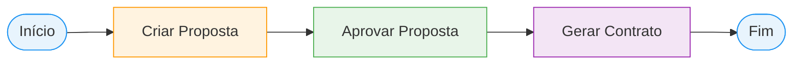
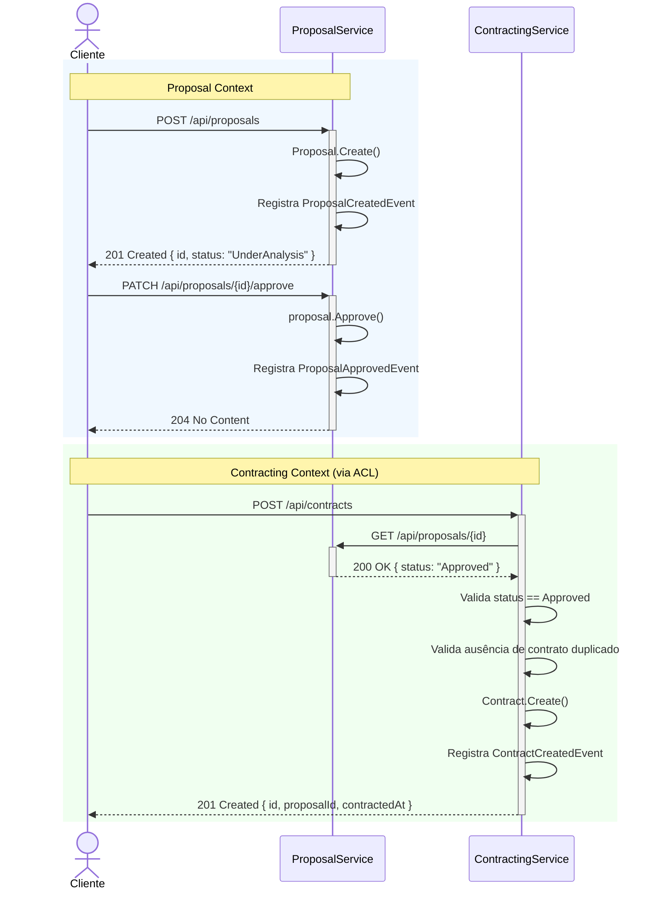
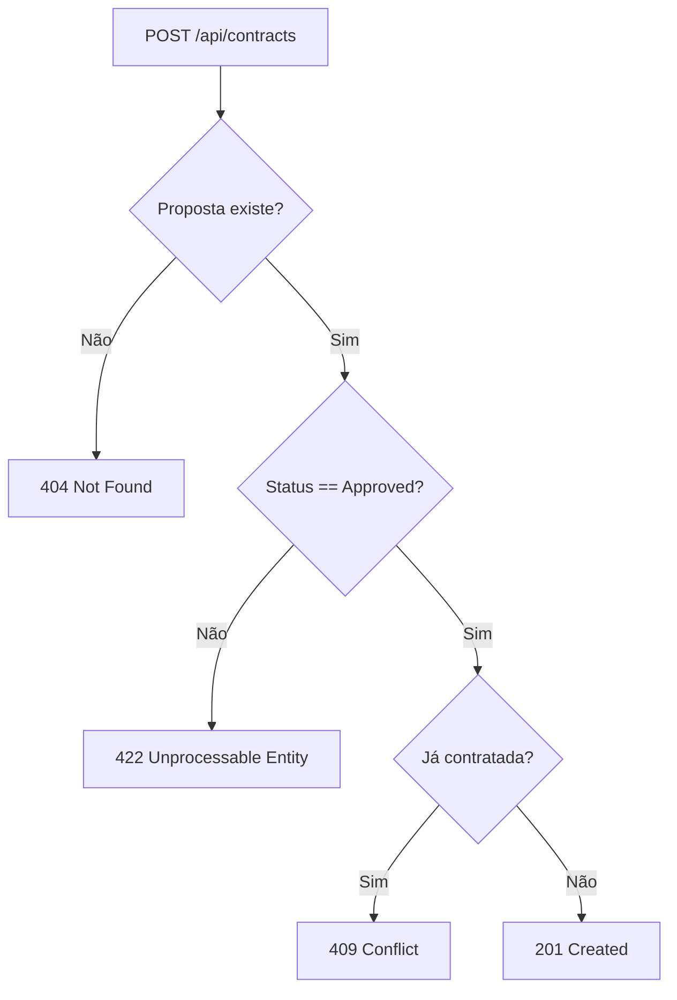

# Insurance Platform

Plataforma de seguros desenvolvida como demonstração técnica para avaliação de Desenvolvedor Back-End .NET Sênior. A solução é composta por dois microsserviços independentes — **ProposalService** e **ContractingService** — implementados com Arquitetura Hexagonal (Ports and Adapters), Domain-Driven Design com modelo rico, CQRS, Domain Events e Anti-Corruption Layer.

---

## Objetivo

O domínio de negócio representa uma plataforma que permite a clientes solicitarem propostas de seguro e, mediante aprovação, efetivarem a contratação.

Uma proposta percorre o seguinte ciclo de vida:

```
UnderAnalysis ──► Approved ──► [Contratação]
              └──► Rejected
```

As regras de negócio centrais são:

| Código | Regra |
|--------|-------|
| RN001 | Toda proposta criada inicia com status `UnderAnalysis` |
| RN002 | Uma proposta pode ser alterada para `Approved` ou `Rejected` |
| RN003 | Somente propostas com status `Approved` podem ser contratadas |
| RN004 | Uma proposta não pode ser contratada mais de uma vez |
| RN005 | Toda contratação registra data e hora UTC da efetivação |
| RN006 | O valor de cobertura deve ser maior que zero |
| RN007 | Uma proposta rejeitada não pode ser aprovada |
| RN008 | Uma proposta já aprovada não pode ser aprovada novamente |

---

## Arquitetura

### Domain-Driven Design (DDD)

A solução adota DDD com **modelo rico**, onde os agregados encapsulam comportamentos e protegem suas invariantes. Nenhuma propriedade expõe setter público — o estado interno só é modificado por métodos do próprio agregado.

```
// Modelo Anêmico (rejeitado)
proposal.Status = ProposalStatus.Approved;

// Modelo Rico (adotado)
proposal.Approve(); // valida, transiciona e registra o evento internamente
```

Os agregados são instanciados exclusivamente via factory methods (`Proposal.Create()`, `Contract.Create()`), garantindo que o objeto nunca seja construído em estado inválido.

**Value Objects** representam conceitos do domínio com semântica e validação próprias:

| Value Object | Contexto | Regras |
|--------------|----------|--------|
| `CustomerName` | ProposalService | Não vazio, máximo 200 caracteres, trim automático |
| `InsuranceType` | ProposalService | Apenas `Life`, `Auto`, `Property`, `Health` |
| `CoverageAmount` | ProposalService | Valor maior que zero |

---

### Arquitetura Hexagonal (Ports and Adapters)

O domínio é o núcleo da aplicação e não depende de nenhum detalhe externo. Todas as dependências apontam para dentro — nunca para fora.

```
┌─────────────────────────────────────────────────────┐
│                  Primary Adapters                    │
│              (Controllers — Api layer)               │
└──────────────────────┬──────────────────────────────┘
                       │  Primary Ports
                       ▼  (ICommandHandler, IQueryHandler)
┌─────────────────────────────────────────────────────┐
│                    Application                       │
│           Commands · Queries · Handlers              │
│                       │                             │
│                       ▼                             │
│                     Domain                          │
│       Aggregates · ValueObjects · Events            │
│       Repositories (interfaces — Secondary Ports)   │
│                       │                             │
└──────────────────────┬──────────────────────────────┘
                       │  Secondary Ports
                       ▼  (IProposalRepository, IContractRepository,
                           IProposalServiceGateway)
┌─────────────────────────────────────────────────────┐
│                 Secondary Adapters                   │
│     (EF Core Repositories · HttpClient Gateway)     │
└─────────────────────────────────────────────────────┘
```

**Regra de dependência entre projetos:**

| Camada | Referencia |
|--------|-----------|
| `Domain` | Nenhum projeto interno |
| `Application` | `Domain` |
| `Infrastructure` | `Application` + `Domain` |
| `Api` | `Application` + `Infrastructure` (apenas para registro de DI) |

---

### CQRS

Os casos de uso são separados por intenção de leitura e escrita, utilizando interfaces genéricas como contratos de Primary Ports:

| Interface | Propósito |
|-----------|-----------|
| `ICommandHandler<TCommand, TResponse>` | Operações de escrita com retorno |
| `IQueryHandler<TQuery, TResponse>` | Operações de leitura |

Cada caso de uso tem seu próprio `Command` ou `Query`, `Handler` e `Response`, organizados em pastas por caso de uso — sem handlers genéricos que misturam responsabilidades.

---

### Domain Events

Os agregados registram eventos internamente após cada operação de estado. Os eventos representam **o que aconteceu** no domínio e são o ponto de extensão para integrações futuras.

| Evento | Disparado por |
|--------|---------------|
| `ProposalCreatedEvent` | `Proposal.Create()` |
| `ProposalApprovedEvent` | `Proposal.Approve()` |
| `ProposalRejectedEvent` | `Proposal.Reject()` |
| `ContractCreatedEvent` | `Contract.Create()` |

Os eventos ficam acumulados na coleção `DomainEvents` do agregado (`AggregateRoot<TId>`) e podem ser publicados após o commit da transação, sem acoplar o fluxo principal a efeitos colaterais.

---

### Anti-Corruption Layer (ACL)

O `ContractingService` precisa validar o status de uma proposta antes de criar um contrato. Para garantir o isolamento entre bounded contexts, a comunicação ocorre exclusivamente via uma interface definida na camada `Application`:

```
ContractingService/Application/Ports/
├── IProposalServiceGateway.cs   ← Secondary Port (contrato)
└── ProposalSnapshot.cs          ← DTO interno ao ContractingService
```

```
ContractingService/Infrastructure/Gateways/
└── ProposalServiceGateway.cs    ← Secondary Adapter (implementação HTTP)
```

O `ContractingService` nunca referencia tipos, entidades ou namespaces do `ProposalService`. A tradução do modelo externo para `ProposalSnapshot` ocorre exclusivamente em `ProposalServiceGateway`, que é o único ponto de acoplamento ao contrato HTTP do serviço externo.

---

### SOLID

| Princípio | Aplicação na solução |
|-----------|---------------------|
| **SRP** | Cada handler tem um único caso de uso. `ApproveProposal` e `RejectProposal` são handlers separados em vez de um `UpdateProposalStatus` genérico |
| **OCP** | Novos casos de uso são adicionados sem modificar handlers existentes. Novos tipos de erro são adicionados sem modificar o middleware |
| **LSP** | Implementações de repositório e gateway são substituíveis por qualquer implementação que respeite o contrato da interface |
| **ISP** | `ICommandHandler` e `IQueryHandler` são interfaces genéricas segregadas por intenção. Repositórios têm contratos mínimos |
| **DIP** | `Application` depende de `IProposalRepository` (abstração no Domain), nunca de `ProposalRepository` (implementação na Infrastructure). `ContractingService` depende de `IProposalServiceGateway`, nunca do `HttpClient` concreto |

---

### Clean Code

- Nomes de classes, métodos e variáveis expressam intenção de negócio
- Sem comentários explicando o que o código faz — o código é autoexplicativo
- Funções com responsabilidade única e baixa complexidade ciclomática
- Sem números mágicos — constantes nomeadas nos Value Objects
- `sealed` em todas as classes que não são projetadas para herança
- `record` para DTOs imutáveis (Commands, Queries, Responses, Domain Events)

---

## Bounded Contexts

### ProposalService

Responsável pelo ciclo de vida completo das propostas de seguro. Gerencia a criação, consulta e transições de status de propostas.

**Aggregate Root:** `Proposal`

**Casos de uso:**

| Caso de Uso | Verbo HTTP | Rota |
|-------------|-----------|------|
| `CreateProposal` | `POST` | `/api/proposals` |
| `GetProposal` | `GET` | `/api/proposals/{id}` |
| `GetAllProposals` | `GET` | `/api/proposals?pageNumber=1&pageSize=10` |
| `ApproveProposal` | `PATCH` | `/api/proposals/{id}/approve` |
| `RejectProposal` | `PATCH` | `/api/proposals/{id}/reject` |

**Value Objects:** `CustomerName`, `InsuranceType`, `CoverageAmount`

**Domain Events:** `ProposalCreatedEvent`, `ProposalApprovedEvent`, `ProposalRejectedEvent`

---

### ContractingService

Responsável pela contratação de propostas aprovadas. Valida o status da proposta via ACL antes de efetivar o contrato.

**Aggregate Root:** `Contract`

**Casos de uso:**

| Caso de Uso | Verbo HTTP | Rota |
|-------------|-----------|------|
| `CreateContract` | `POST` | `/api/contracts` |
| `GetContract` | `GET` | `/api/contracts/{id}` |

**Domain Events:** `ContractCreatedEvent`

**ACL:** `IProposalServiceGateway` → `ProposalServiceGateway`

---

## Arquitetura da Solução

```
insurance-platform/
│
├── src/
│   ├── ProposalService/
│   │   ├── InsurancePlatform.ProposalService.Domain/
│   │   ├── InsurancePlatform.ProposalService.Application/
│   │   ├── InsurancePlatform.ProposalService.Infrastructure/
│   │   └── InsurancePlatform.ProposalService.Api/
│   │
│   └── ContractingService/
│       ├── InsurancePlatform.ContractingService.Domain/
│       ├── InsurancePlatform.ContractingService.Application/
│       ├── InsurancePlatform.ContractingService.Infrastructure/
│       └── InsurancePlatform.ContractingService.Api/
│
├── tests/
│   ├── ProposalService/
│   │   ├── InsurancePlatform.ProposalService.Domain.UnitTests/
│   │   ├── InsurancePlatform.ProposalService.Application.UnitTests/
│   │   └── InsurancePlatform.ProposalService.Api.IntegrationTests/
│   │
│   └── ContractingService/
│       ├── InsurancePlatform.ContractingService.Domain.UnitTests/
│       ├── InsurancePlatform.ContractingService.Application.UnitTests/
│       └── InsurancePlatform.ContractingService.Api.IntegrationTests/
│
├── docs/
│   ├── sdd/                   ← Software Design Documents
│   └── adrs/                  ← Architecture Decision Records
│
└── docker/
    ├── docker-compose.yml
    └── docker-compose.override.yml
```

### Papel de Cada Camada

**`Domain`** — núcleo da aplicação, completamente isolado de dependências externas. Contém os Aggregates, Value Objects, Domain Events, interfaces de repositório (Secondary Ports) e o `SeedWork` (`Entity<TId>`, `AggregateRoot<TId>`, `ValueObject`, `IDomainEvent`). Zero dependências de pacotes NuGet externos.

**`Application`** — orquestra os casos de uso. Contém Commands, Queries, Handlers, interfaces de Primary Ports (`ICommandHandler`, `IQueryHandler`), exceções de aplicação e, no `ContractingService`, os Secondary Ports de integração (`IProposalServiceGateway`, `ProposalSnapshot`). Depende apenas do `Domain`.

**`Infrastructure`** — implementa os Secondary Ports. Contém o `DbContext`, mapeamentos EF Core via Fluent API, implementações de repositório e o `ProposalServiceGateway`. Registra as implementações via extension method `AddXxxInfrastructure()`. Depende de `Application` e `Domain`.

**`Api`** — ponto de entrada HTTP. Contém os Controllers (Primary Adapters), o `ExceptionHandlerMiddleware` com mapeamento para `ProblemDetails` (RFC 7807), `Program.cs` e configurações de Swagger/OpenAPI. Depende de `Application` e `Infrastructure` (apenas para DI).

---

## Tecnologias Utilizadas

| Tecnologia | Versão | Uso |
|------------|--------|-----|
| .NET | 8.0 | Plataforma base |
| ASP.NET Core | 8.0 | Framework HTTP e injeção de dependências |
| Entity Framework Core | 8.0 | ORM com migrations versionadas |
| Npgsql (EF Core Provider) | 8.0 | Driver PostgreSQL para EF Core |
| PostgreSQL | 16 | Banco de dados relacional |
| Docker | — | Containerização dos serviços |
| Docker Compose | — | Orquestração local dos containers |
| Swashbuckle / Swagger | 6.6 | Documentação OpenAPI interativa |
| xUnit | 2.5 | Framework de testes |
| FluentAssertions | 6.12 | Assertions expressivas nos testes |
| Moq | 4.20 | Mocking de interfaces nos testes unitários |
| Testcontainers.PostgreSql | 3.6 | PostgreSQL real em containers nos testes de integração |
| FluentValidation | 11.9 | Validação de Commands e Queries na camada Application |

---

## Como Executar Localmente

### Pré-requisitos

- [Docker Desktop](https://www.docker.com/products/docker-desktop/) instalado e em execução
- [.NET 8 SDK](https://dotnet.microsoft.com/download/dotnet/8.0) (para desenvolvimento local)

### Executando via Docker Compose

```bash
docker-compose up --build
```

Todos os serviços sobem automaticamente, incluindo o banco de dados PostgreSQL e a aplicação das migrations.

### URLs disponíveis

| Serviço | URL |
|---------|-----|
| ProposalService — API | http://localhost:5001 |
| ContractingService — API | http://localhost:5002 |
| ProposalService — Swagger | http://localhost:5001/swagger |
| ContractingService — Swagger | http://localhost:5002/swagger |
| ProposalService — Health | http://localhost:5001/health |
| ContractingService — Health | http://localhost:5002/health |

### Executando individualmente (sem Docker)

1. Certifique-se de ter uma instância PostgreSQL rodando localmente
2. Ajuste as connection strings em `appsettings.Development.json` de cada serviço
3. Execute as migrations:

```bash
# ProposalService
dotnet ef database update \
  --project src/ProposalService/InsurancePlatform.ProposalService.Infrastructure \
  --startup-project src/ProposalService/InsurancePlatform.ProposalService.Api

# ContractingService
dotnet ef database update \
  --project src/ContractingService/InsurancePlatform.ContractingService.Infrastructure \
  --startup-project src/ContractingService/InsurancePlatform.ContractingService.Api
```

4. Inicie os serviços:

```bash
dotnet run --project src/ProposalService/InsurancePlatform.ProposalService.Api
dotnet run --project src/ContractingService/InsurancePlatform.ContractingService.Api
```

---

## Fluxo de Negócio

O fluxo completo de contratação envolve os dois microsserviços com validação cross-context via ACL.

### Visão Simplificada



### Fluxo Detalhado entre Microsserviços



### Cenários de Erro



---

## Testes

A estratégia de testes segue a pirâmide de testes com três níveis de cobertura.

### Visão Geral

| Nível | Projetos | Testes | Ferramentas |
|-------|----------|--------|-------------|
| Domain Unit Tests | 2 | 22 | xUnit, FluentAssertions |
| Application Unit Tests | 2 | 26 | xUnit, FluentAssertions, Moq |
| API Integration Tests | 2 | 11 | xUnit, FluentAssertions, Testcontainers, Mvc.Testing |
| **Total** | **6** | **59** | — |

### Nível 1 — Testes Unitários de Domínio

Testam os agregados e Value Objects em isolamento completo — sem mocks, sem banco, sem HTTP. São os testes mais rápidos e com maior cobertura de invariantes.

Exemplos de cobertura:
- `Proposal.Create()` inicia com status `UnderAnalysis`
- `Proposal.Create()` registra `ProposalCreatedEvent`
- `Proposal.Approve()` transiciona status para `Approved`
- `Proposal.Approve()` lança `DomainException` quando status não é `UnderAnalysis`
- `Proposal.Reject()` após `Approve()` lança `DomainException`
- `CoverageAmount` com valor zero lança `DomainException`
- `CustomerName` vazio lança `DomainException`
- `Contract.Create()` com `Guid.Empty` lança `DomainException`

### Nível 2 — Testes Unitários de Application

Testam os handlers de cada caso de uso com repositórios e gateways mockados via interfaces. Verificam fluxos de sucesso e todos os cenários de falha.

Exemplos de cobertura:
- `CreateProposalHandler` persiste e retorna resposta com `Id`
- `ApproveProposalHandler` chama `Approve()` e `UpdateAsync()`
- `GetProposalHandler` lança `NotFoundException` quando proposta inexistente
- `CreateContractHandler` consulta gateway antes de criar contrato
- `CreateContractHandler` lança `ProposalNotApprovedException` quando proposta não aprovada
- `CreateContractHandler` lança `ProposalAlreadyContractedException` quando proposta já contratada
- `GetAllProposalsHandler` preserva metadados de paginação (`TotalPages`, `TotalItems`)

### Nível 3 — Testes de Integração de API

Testam o fluxo HTTP completo com banco de dados PostgreSQL real provisionado via **Testcontainers**. Eliminam o risco de divergência entre mocks e comportamento real do banco.

Cada projeto de integração utiliza `WebApplicationFactory<Program>` com override da connection string para o container provisionado em tempo de execução.

Exemplos de cobertura:
- `POST /proposals` retorna `201 Created` com corpo correto
- `GET /proposals/{id}` para proposta inexistente retorna `404 Not Found`
- `PATCH /proposals/{id}/approve` para proposta já aprovada retorna `422 Unprocessable Entity`
- `POST /contracts` retorna `201 Created` para proposta aprovada
- `POST /contracts` retorna `409 Conflict` quando proposta já contratada
- `GET /contracts/{id}` para contrato inexistente retorna `404 Not Found`

---

## Execução dos Testes

### Testes Unitários

Os testes unitários não possuem dependências externas e podem ser executados diretamente pelo **Visual Studio**, pelo **Rider** ou via linha de comando em qualquer sistema operacional.

```bash
# Todos os testes unitários de domínio e aplicação
dotnet test tests/ProposalService/InsurancePlatform.ProposalService.Domain.UnitTests
dotnet test tests/ProposalService/InsurancePlatform.ProposalService.Application.UnitTests
dotnet test tests/ContractingService/InsurancePlatform.ContractingService.Domain.UnitTests
dotnet test tests/ContractingService/InsurancePlatform.ContractingService.Application.UnitTests

# Ou todos de uma vez
dotnet test --filter "FullyQualifiedName!~IntegrationTests"
```

### Testes de Integração

Os testes de integração utilizam **Testcontainers** para provisionar automaticamente um container **PostgreSQL** real durante a execução. Por esse motivo, exigem o **Docker** ativo na máquina.

> **Recomendação:** executar os testes de integração preferencialmente via **WSL (Windows Subsystem for Linux)** com o Docker Desktop configurado para integração com WSL 2. Isso evita problemas de permissão de socket e garante a comunicação correta entre o processo .NET e o daemon Docker.

```bash
# ProposalService — integração
dotnet test ./tests/ProposalService/InsurancePlatform.ProposalService.Api.IntegrationTests

# ContractingService — integração
dotnet test ./tests/ContractingService/InsurancePlatform.ContractingService.Api.IntegrationTests
```

O Testcontainers gerencia o ciclo de vida do container automaticamente: provisiona antes dos testes, aplica as migrations via EF Core e destrói o container ao final da execução. Nenhuma configuração manual de banco de dados é necessária.

---

## Qualidade da Solução

| Indicador | Valor |
|-----------|-------|
| Testes unitários | **48** |
| Testes de integração | **11** |
| Total de testes automatizados | **59** |
| Projetos de teste | 6 |
| Projetos de produção | 8 |
| Microsserviços | 2 |
| Bounded Contexts | 2 |

**Padrões e práticas aplicadas:**

| Prática | Aplicação |
|---------|-----------|
| Arquitetura Hexagonal | Ports and Adapters em todos os microsserviços |
| Domain-Driven Design | Modelo rico, Aggregate Roots, Value Objects, Domain Events |
| SOLID | Aplicado em todas as camadas — handlers, repositórios, gateways |
| CQRS | Commands e Queries separados por intenção |
| Domain Events | 4 eventos registrados pelos agregados |
| Anti-Corruption Layer | `IProposalServiceGateway` + `ProposalSnapshot` isolando os contextos |
| Persistência | EF Core com Fluent API, migrations versionadas, mapeamento de Value Objects via `OwnsOne` |
| Containerização | Docker + Docker Compose para execução local completa |
| Banco de dados | PostgreSQL com índice único em `proposal_id` para garantir unicidade de contratos |

---

## Tratamento de Erros

Todos os serviços possuem um `ExceptionHandlerMiddleware` global que intercepta exceções não tratadas e retorna respostas padronizadas no formato `ProblemDetails` (RFC 7807).

### Mapeamento de Exceções para HTTP

| Exceção | Status HTTP | Cenário |
|---------|-------------|---------|
| `NotFoundException` | `404 Not Found` | Recurso não encontrado |
| `DomainException` | `422 Unprocessable Entity` | Violação de invariante de domínio |
| `ProposalNotApprovedException` | `422 Unprocessable Entity` | Proposta não está aprovada para contratação |
| `ProposalAlreadyContractedException` | `409 Conflict` | Proposta já possui contratação |
| `ValidationException` | `400 Bad Request` | Payload de entrada inválido |
| `Exception` | `500 Internal Server Error` | Erros inesperados |

### Exemplo de resposta de erro

```json
{
  "title": "Not Found",
  "status": 404,
  "detail": "Proposal with id 'xxxxxxxx-xxxx-xxxx-xxxx-xxxxxxxxxxxx' was not found.",
  "instance": "/api/proposals/xxxxxxxx-xxxx-xxxx-xxxx-xxxxxxxxxxxx"
}
```

---

## Decisões Arquiteturais

A documentação completa dos ADRs está em [`docs/sdd/05-decisoes-arquiteturais.md`](docs/sdd/05-decisoes-arquiteturais.md).

| ADR | Decisão | Justificativa |
|-----|---------|---------------|
| ADR-001 | Modelo de Domínio Rico | Invariantes garantidas no agregado, sem lógica de negócio vazando para camadas externas |
| ADR-002 | Value Objects | Validação centralizada, igualdade semântica, fail-fast na construção |
| ADR-003 | Domain Events | Extensibilidade de efeitos colaterais sem acoplamento ao fluxo principal |
| ADR-004 | Ports and Adapters Explícitos | Fronteiras claras, substituição de implementações sem impacto no domínio |
| ADR-005 | Anti-Corruption Layer | Bounded contexts isolados e evolutivos de forma independente |
| ADR-006 | Casos de Uso por Intenção | SRP aplicado: `ApproveProposal` e `RejectProposal` em vez de `UpdateProposalStatus` |
| ADR-007 | Paginação em Listagens | Desempenho previsível em produção independente do volume de dados |
| ADR-008 | Tratamento de Erros Centralizado | Consistência nas respostas HTTP, controllers sem try/catch |
| ADR-009 | Pirâmide de Testes | Cobertura em três níveis: domínio puro, application com mocks e integração com banco real |
| ADR-010 | FluentValidation | Separação entre validação de formato (Application) e invariante de negócio (Domain) |
| ADR-011 | SeedWork por Microsserviço | Independência total entre serviços, sem acoplamento via projeto compartilhado |

---

## Diferenciais Arquiteturais

Esta solução foi desenvolvida com atenção explícita aos diferenciais que distinguem uma entrega sênior de uma implementação funcional comum.

### Bounded Contexts independentes

Os dois microsserviços não compartilham nenhum projeto, biblioteca, tipo ou namespace. Cada serviço possui seu próprio `Domain`, `Application`, `Infrastructure`, banco de dados e pipeline de migrations. Podem ser deployados, versionados e escalados de forma completamente independente.

### Modelo Rico de Domínio

Os agregados `Proposal` e `Contract` encapsulam comportamento e protegem invariantes. O estado interno nunca é modificado diretamente — toda transição passa por métodos de negócio do próprio agregado (`Approve()`, `Reject()`, `Create()`). Construtores privados e factory methods garantem que objetos inválidos não possam ser instanciados.

### Value Objects com validação fail-fast

`CustomerName`, `InsuranceType` e `CoverageAmount` encapsulam regras de validação e semântica de negócio. Uma string vazia para `CustomerName` ou um valor zero para `CoverageAmount` falham na construção do Value Object, antes de qualquer lógica de persistência ser acionada.

### Domain Events acoplados ao agregado

Os eventos são registrados pelo próprio agregado no momento da operação, sem dependência de serviços externos. A coleção `DomainEvents` no `AggregateRoot<TId>` armazena os eventos até a publicação pós-commit, viabilizando integração futura com mensageria sem necessidade de refatoração dos agregados.

### Separação de responsabilidades por intenção

Em vez de um genérico `UpdateProposalStatus`, a solução expõe `ApproveProposal` e `RejectProposal` como casos de uso separados, cada um com seu próprio handler, command e endpoint. Isso aplica SRP de forma explícita e cria APIs semanticamente corretas.

### Alta coesão e baixo acoplamento

Cada pasta de caso de uso (`UseCases/CreateProposal/`, `UseCases/ApproveProposal/`, etc.) contém exclusivamente os artefatos do seu próprio fluxo: command, handler e response. Não há classe que agregue múltiplos casos de uso ou dependa de handlers irmãos.

### Testabilidade por design

Todas as dependências externas são injetadas via interface. Não há acesso direto a banco de dados, HTTP ou serviços externos nas camadas `Domain` e `Application`. Os testes unitários validam comportamento de negócio puro sem infraestrutura; os testes de integração validam o stack completo com banco real via Testcontainers.

---

## Melhorias Futuras

A solução está preparada arquiteturalmente para as seguintes evoluções, que não foram implementadas por estarem fora do escopo da avaliação:

| Melhoria | Benefício |
|----------|-----------|
| **Outbox Pattern** | Garantir a publicação de Domain Events de forma atômica com a transação de banco de dados, eliminando risco de perda de eventos |
| **Mensageria (RabbitMQ / Apache Kafka)** | Substituir a comunicação HTTP síncrona entre serviços por comunicação assíncrona orientada a eventos, aumentando resiliência e desacoplamento |
| **Cache Distribuído (Redis)** | Cache de consultas frequentes no `ProposalService`, reduzindo latência e carga no banco de dados |
| **Observabilidade (OpenTelemetry)** | Rastreamento distribuído entre microsserviços, métricas de negócio e logs estruturados centralizados (Elasticsearch, Grafana, Jaeger) |
| **Autenticação e Autorização (JWT / OAuth 2.0)** | Controle de acesso aos endpoints com escopos por perfil de usuário |
| **Pipeline de CI/CD (GitHub Actions)** | Build, execução de testes e publicação de imagens Docker automatizados a cada push |
| **Kubernetes (K8s)** | Orquestração de containers em ambiente de produção com escalabilidade horizontal, health checks e rollout controlado |
| **AWS (ECS / RDS / SQS)** | Deploy em nuvem com serviços gerenciados para banco de dados, mensageria e execução de containers |

---

## Documentação Técnica

| Documento | Descrição |
|-----------|-----------|
| [`docs/sdd/01-visao-geral.md`](docs/sdd/01-visao-geral.md) | Visão geral do domínio, regras de negócio e requisitos |
| [`docs/sdd/02-ddd-e-bounded-contexts.md`](docs/sdd/02-ddd-e-bounded-contexts.md) | Bounded Contexts, agregados, Value Objects e casos de uso |
| [`docs/sdd/03-arquitetura-hexagonal.md`](docs/sdd/03-arquitetura-hexagonal.md) | Ports, Adapters, fluxos e mapa de localização de artefatos |
| [`docs/sdd/04-modelagem-do-dominio.md`](docs/sdd/04-modelagem-do-dominio.md) | Modelagem detalhada, invariantes e estratégia de erros |
| [`docs/sdd/05-decisoes-arquiteturais.md`](docs/sdd/05-decisoes-arquiteturais.md) | Architecture Decision Records (ADRs) |

---

## Autor

**Webert Amaral Lopes Cançado**

Engenheiro de Software .NET
