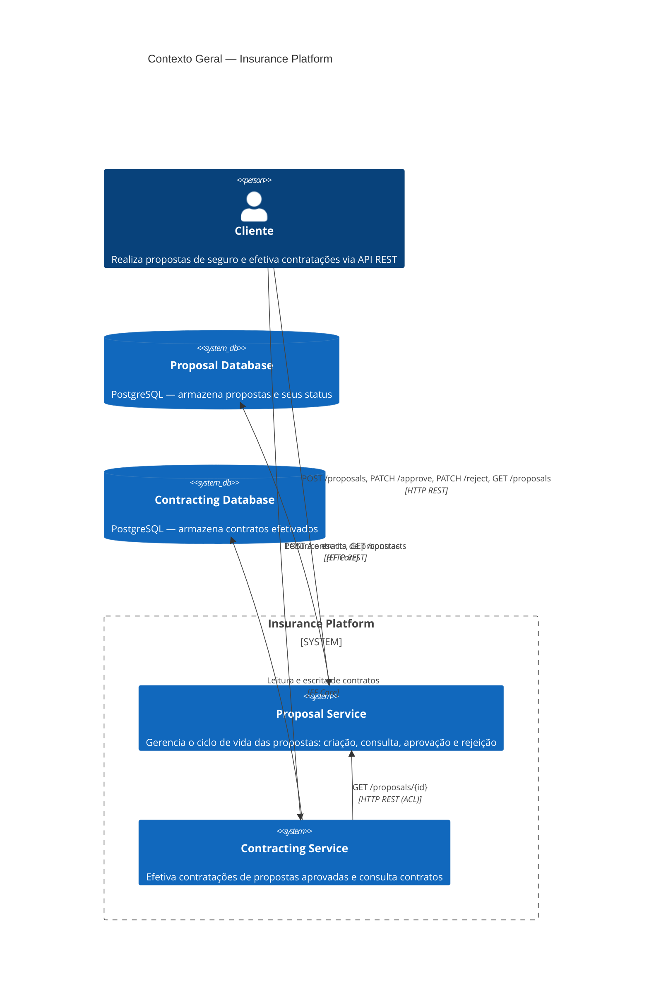
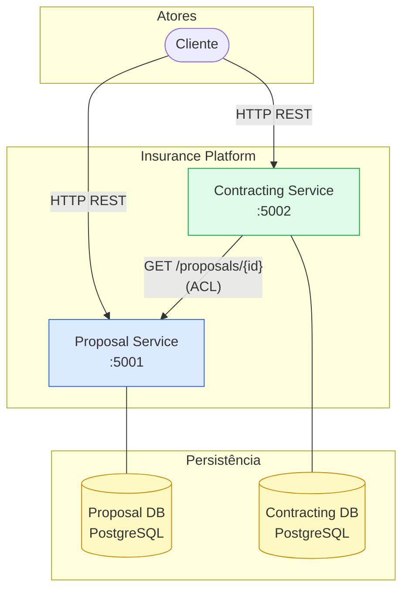

# Diagrama de Contexto Geral

Visão de alto nível da plataforma de seguros, seus atores e a relação entre os microsserviços.

---

## Contexto do Sistema

---

## Descrição dos Componentes

| Componente | Tipo | Responsabilidade |
|------------|------|-----------------|
| **Cliente** | Ator externo | Consome os endpoints REST de ambos os serviços |
| **Proposal Service** | Microsserviço | Ciclo de vida completo das propostas de seguro |
| **Contracting Service** | Microsserviço | Contratação de propostas aprovadas |
| **Proposal Database** | Banco de dados | Persistência das propostas (PostgreSQL) |
| **Contracting Database** | Banco de dados | Persistência dos contratos (PostgreSQL) |

---

## Diagrama Simplificado de Contexto

---

## Regras de Comunicação

- O **Cliente** se comunica diretamente com ambos os serviços via HTTP REST
- O **Contracting Service** consulta o **Proposal Service** via ACL (`IProposalServiceGateway`) para verificar o status de uma proposta antes de criar um contrato
- Os dois serviços possuem **bancos de dados independentes** — não há acesso cruzado entre os bancos
- O `ContractingService` nunca acessa diretamente o banco do `ProposalService`
