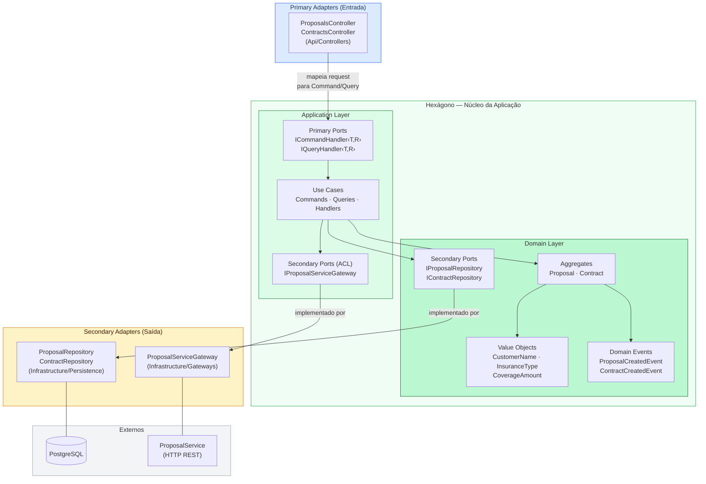
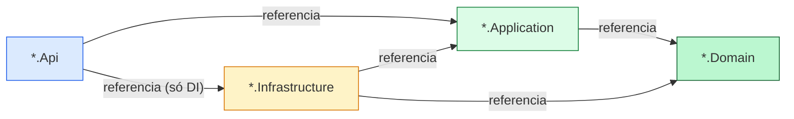
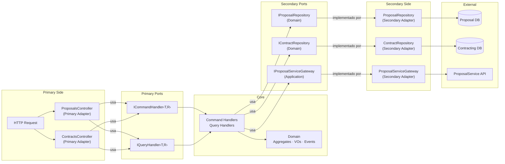

# Diagrama de Arquitetura Hexagonal

Representação visual da Arquitetura Hexagonal (Ports and Adapters) aplicada em ambos os microsserviços.

---

## Visão do Hexágono — Estrutura Geral

---

## Direção de Dependências entre Projetos

> A seta indica "depende de". O `Domain` não possui setas de saída — zero dependências externas.

---

## Mapa de Ports e Adapters

---

## Referência de Localização dos Artefatos

| Artefato | Tipo | Camada | Localização no Projeto |
|----------|------|--------|----------------------|
| `ICommandHandler<,>` | Primary Port | Application | `Application/Common/` |
| `IQueryHandler<,>` | Primary Port | Application | `Application/Common/` |
| `IProposalRepository` | Secondary Port | Domain | `Domain/Repositories/` |
| `IContractRepository` | Secondary Port | Domain | `Domain/Repositories/` |
| `IProposalServiceGateway` | Secondary Port (ACL) | Application | `Application/Ports/` |
| `ProposalsController` | Primary Adapter | Api | `Api/Controllers/` |
| `ContractsController` | Primary Adapter | Api | `Api/Controllers/` |
| `ProposalRepository` | Secondary Adapter | Infrastructure | `Infrastructure/Persistence/Repositories/` |
| `ContractRepository` | Secondary Adapter | Infrastructure | `Infrastructure/Persistence/Repositories/` |
| `ProposalServiceGateway` | Secondary Adapter (ACL) | Infrastructure | `Infrastructure/Gateways/` |
