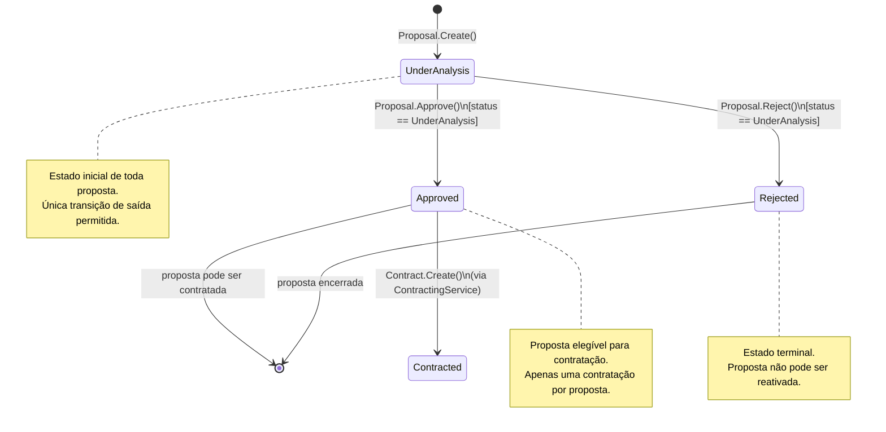
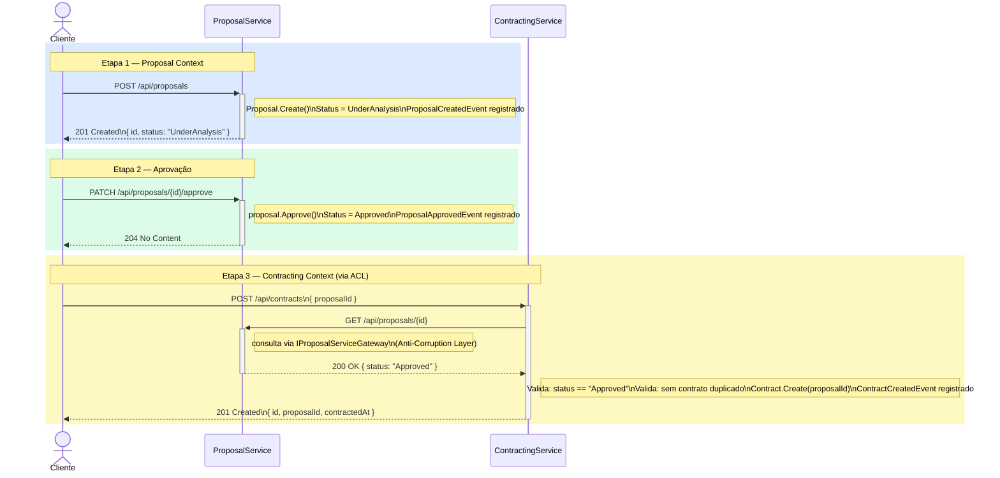
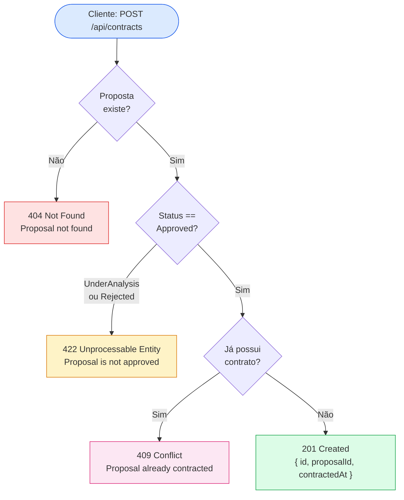

# Diagrama de Fluxo de Negócio

Representação dos fluxos de negócio da plataforma, do ciclo de vida da proposta até a efetivação do contrato.

---

## Ciclo de Vida da Proposta



---

## Fluxo Completo de Contratação



---

## Cenários de Erro no Fluxo de Contratação



---

## Cenários de Erro na Transição de Status

```mermaid
flowchart TD
    APPROVE([PATCH /proposals/{id}/approve]) --> Q1{Proposta\nexiste?}
    REJECT([PATCH /proposals/{id}/reject]) --> Q1

    Q1 -->|Não| E1["404 Not Found"]
    Q1 -->|Sim| Q2{Status ==\nUnderAnalysis?}

    Q2 -->|"Approved\nou Rejected"| E2["422 Unprocessable Entity\nDomainException:\nCannot approve/reject a proposal\nwith status 'Approved'"]
    Q2 -->|Sim| OK["204 No Content"]

    style E1 fill:#fee2e2,stroke:#dc2626
    style E2 fill:#fef3c7,stroke:#d97706
    style OK fill:#dcfce7,stroke:#16a34a
```

---

## Regras de Negócio por Transição

| Operação | Pré-condição | Pós-condição | Evento registrado |
|----------|-------------|--------------|-------------------|
| `Proposal.Create()` | Parâmetros válidos (VO) | Status = `UnderAnalysis` | `ProposalCreatedEvent` |
| `Proposal.Approve()` | `Status == UnderAnalysis` | Status = `Approved` | `ProposalApprovedEvent` |
| `Proposal.Reject()` | `Status == UnderAnalysis` | Status = `Rejected` | `ProposalRejectedEvent` |
| `Contract.Create()` | Proposta `Approved`, sem contrato duplicado | Contrato criado com data UTC | `ContractCreatedEvent` |
