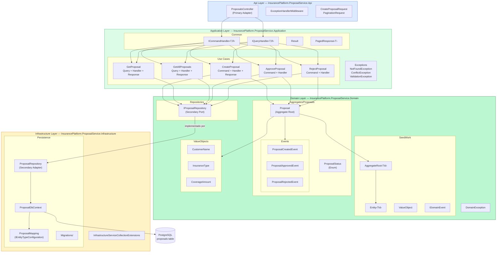
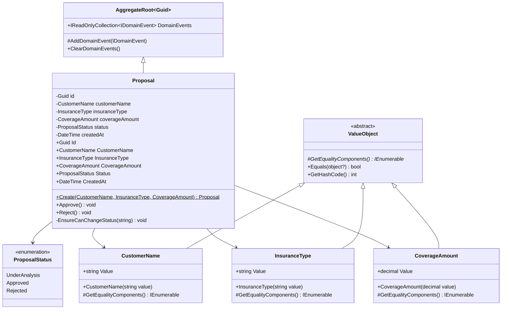
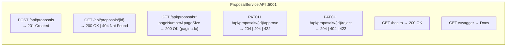
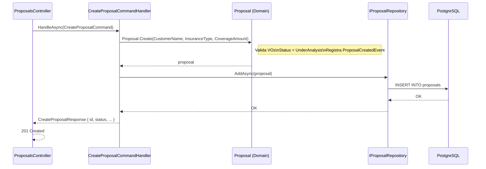
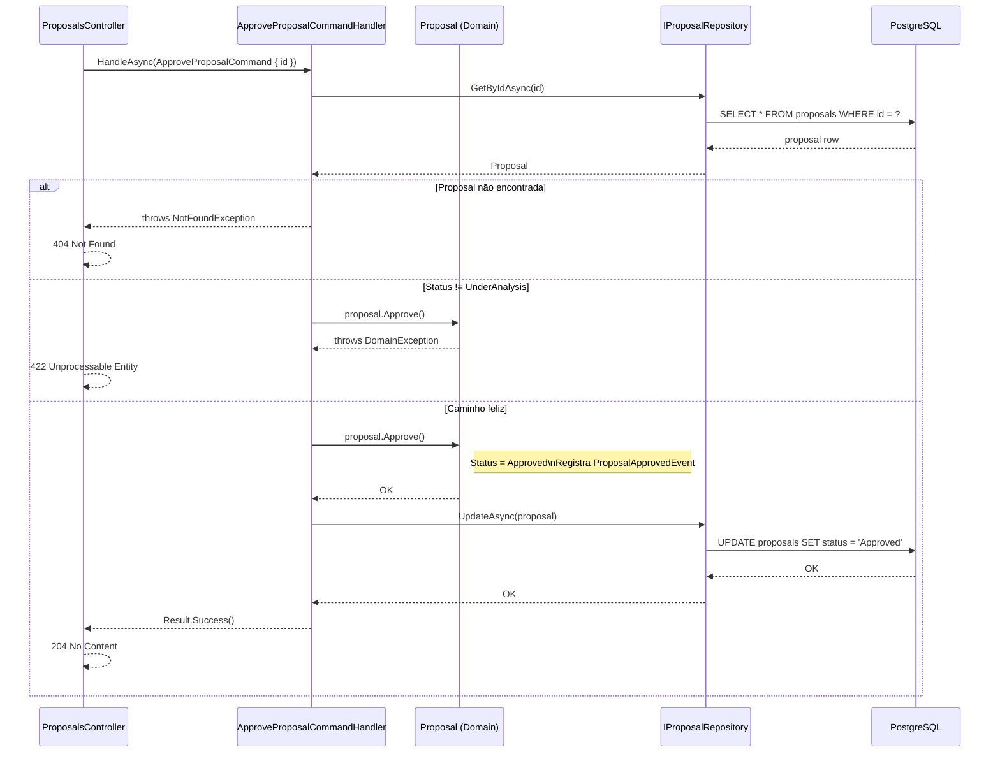

# Diagrama — Proposal Service

Visão interna completa do ProposalService: estrutura de camadas, agregado, casos de uso e fluxos.

---

## Estrutura de Camadas

---

## Modelo do Agregado Proposal

---

## Endpoints REST

---

## Fluxo Interno — CreateProposal

---

## Fluxo Interno — ApproveProposal

