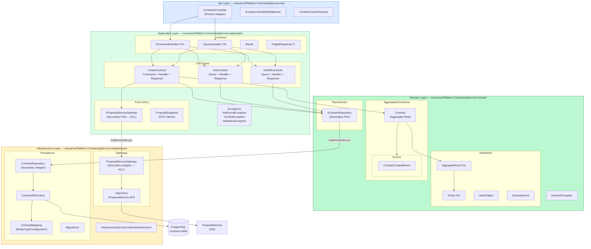
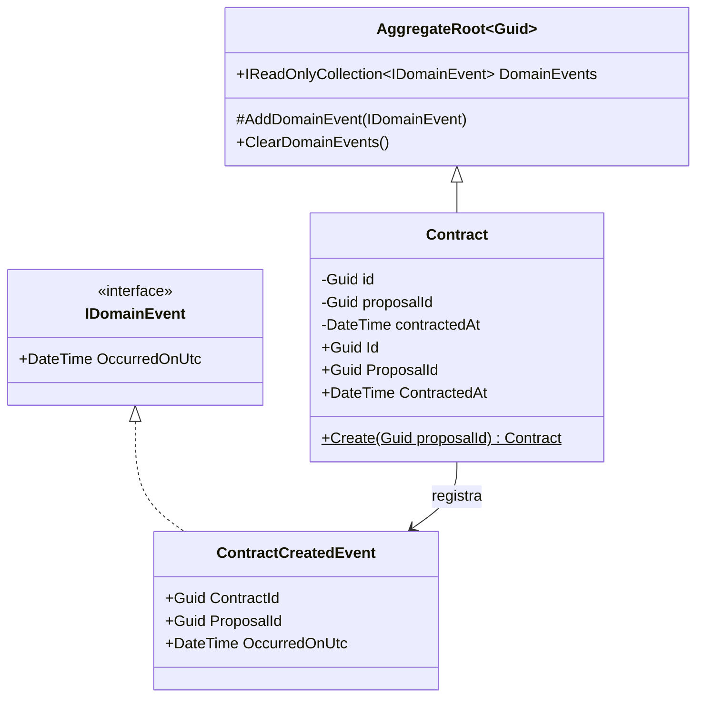
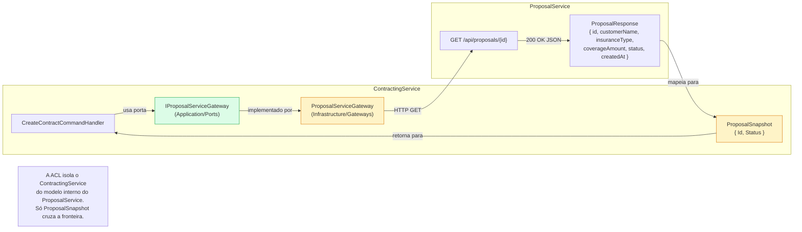
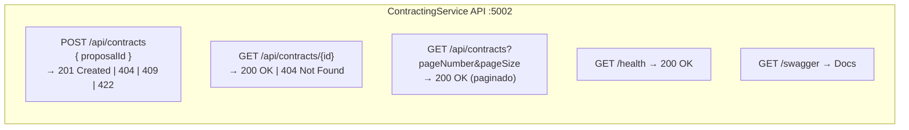
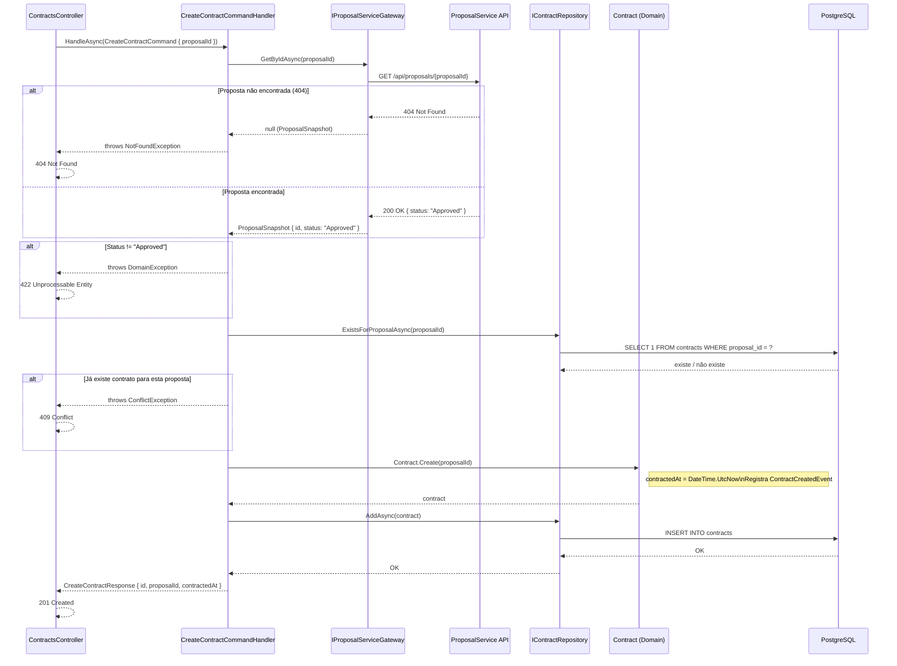
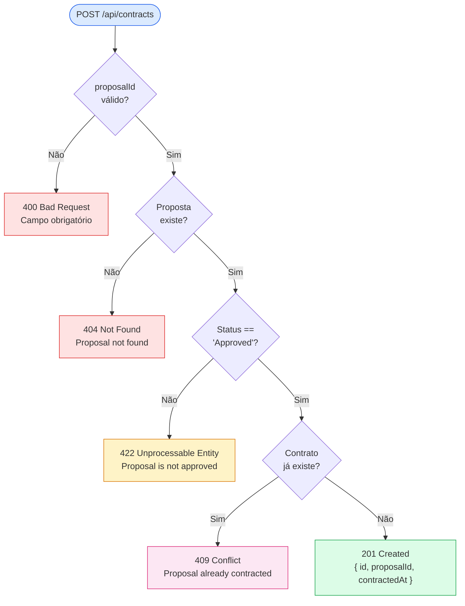

# Diagrama — Contracting Service

Visão interna completa do ContractingService: estrutura de camadas, agregado, ACL, casos de uso e fluxos.

---

## Estrutura de Camadas

---

## Modelo do Agregado Contract

---

## Anti-Corruption Layer (ACL)

---

## Endpoints REST

---

## Fluxo Interno — CreateContract

---

## Validações no CreateContract

